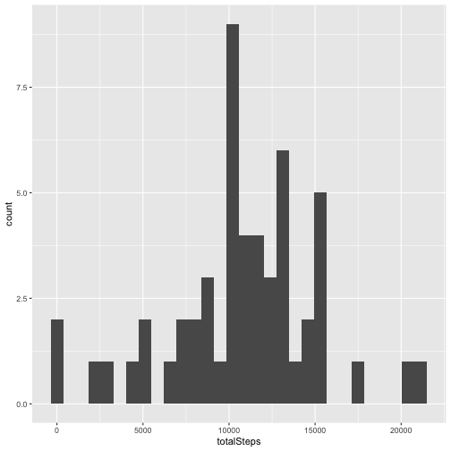
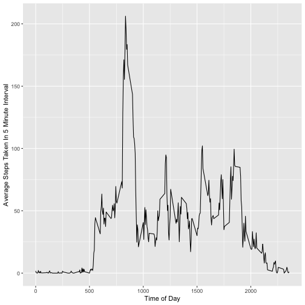
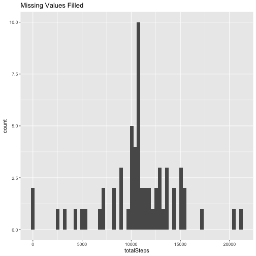
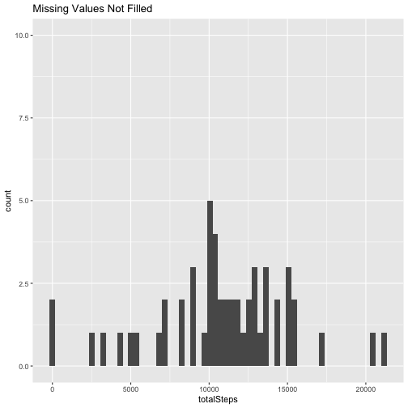
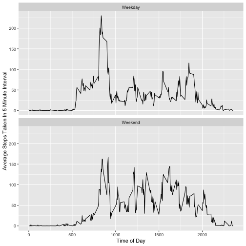

Course Project 2
================

This is the R markdown file for Course Project 2 for Reproducible Research.

First we make the global setting to show the code.


Now, we load the data


``` r
steps <- read.csv("activity.csv")
library(dplyr)
```

```
## 
## Attaching package: 'dplyr'
```

```
## The following objects are masked from 'package:stats':
## 
##     filter, lag
```

```
## The following objects are masked from 'package:base':
## 
##     intersect, setdiff, setequal, union
```

``` r
library(ggplot2)
```

Next, we create a dataset that stores the number of steps taken in each day and then plot the steps taken per day in a histogram.


``` r
perDay <- steps %>% group_by(date) %>% summarize(totalSteps = sum(steps))
ggplot(perDay, aes(x = totalSteps)) + geom_histogram()
```

```
## `stat_bin()` using `bins = 30`. Pick better value with `binwidth`.
```

```
## Warning: Removed 8 rows containing non-finite outside the scale range
## (`stat_bin()`).
```



Now, We get the mean and median of steps taken each day.

First the mean:


``` r
mean(perDay$totalSteps, na.rm = TRUE)
```

```
## [1] 10766.19
```

Now the median:


``` r
median(perDay$totalSteps, na.rm = TRUE)
```

```
## [1] 10765
```

Now we will create a plot that shows the average number of steps taken across all days for each five minute interval.

First, we'll create a new dataset that stores the average steps for each interval.


``` r
perInterval <- steps %>% group_by(interval) %>% summarize(avgSteps = mean(steps, na.rm = TRUE))
```

Now we'll plot the average steps taken during each interval on a line plot


``` r
ggplot(perInterval, aes(x = interval, y = avgSteps)) + geom_line() + ylab("Average Steps Taken In 5 Minute Interval") + xlab("Time of Day")
```



Now we'll find the interval with the maximum number of steps per day


``` r
indexMax <- which.max(perInterval$avgSteps)
maxStepsInterval <- perInterval$interval[indexMax]
maxStepsInterval
```

```
## [1] 835
```

Next, we'll find the number of missing values in the dataset.


``` r
sum(is.na(steps$steps))
```

```
## [1] 2304
```
Now, we'll fill in the missing values with the average number of steps taken in the corresponding interval across all other days.


``` r
steps2 <- steps
for (i in 1:length(steps$steps)) {
  if (is.na(steps$steps[i])) {
    index <- which(perInterval$interval == steps$interval[i])
    steps2$steps[i] <- perInterval$avgSteps[index]
  }
  else {
    steps2$steps[i] <- steps$steps[i]
  }
}
```
Now, we will remake the histogram and recalculate the mean and median and compare to the dataset with the missing values not filled in


``` r
perDay2 <- steps2 %>% group_by(date) %>% summarize(totalSteps = sum(steps))

ggplot(perDay2, aes(x = totalSteps)) + geom_histogram(bins = 60) + ggtitle("Missing Values Filled") + ylim(0,10)
```



``` r
ggplot(perDay, aes(x = totalSteps)) + geom_histogram(bins = 60) + ggtitle("Missing Values Not Filled") + ylim(0,10)
```

```
## Warning: Removed 8 rows containing non-finite outside the scale range
## (`stat_bin()`).
```



As the two plots above show, filling in missing values based on the mean steps taken during the corresponding interval does not change the shape of the histogram, other than to add the frequency of the most common values of steps per day, beefing up the middle of the histogram, where those values are.

Now, we'll create a new factor variable that indicates whether each day is a weekday or weekend


``` r
steps2$weekend <- factor(weekdays(as.POSIXlt(steps2$date)) == "Saturday" | weekdays(as.POSIXlt(steps2$date)) == "Sunday")
levels(steps2$weekend) <- c("Weekday","Weekend")
```

Next, we'll use this factor variable to create a paneled plot comparing the average steps taken per interval on weekdays and weekends


``` r
perInterval2 <- steps2 %>% group_by(interval,weekend) %>% summarize(avgSteps = mean(steps))
```

```
## `summarise()` has grouped output by 'interval'. You can override using the
## `.groups` argument.
```

``` r
p <- ggplot(perInterval2, aes(x = interval, y = avgSteps)) + geom_line() + ylab("Average Steps Taken In 5 Minute Interval") + xlab("Time of Day")

p + facet_wrap(~perInterval2$weekend, nrow = 2)
```



The paneled plot shows a few differences between weekdays and weekends. On weekdays, we see a spike right after 5 am, while on weekends, there isn't much of a spike until about 8 am. During the middle of the day, we see more steps being taken on average during the weekend. Finally, towards the end of the day, the steps generally trail off toward zero from 6 to 8 pm on weekdays, while on weekends, this trail offd oesn't happen until after 8 pm.
